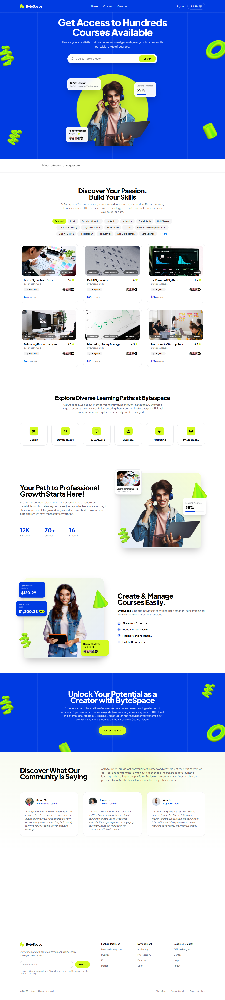

# ByteSpace 🚀

A modern, high-performance web platform built strictly from the Figma design specification for the **ByteSpace** assessment.



---

## 🌟 Live Demo & Links

- **Live Deployment (Vercel)**: [https://bytespace.vercel.app](https://bytespace.vercel.app) *(or your deployed Vercel URL)*
- **GitHub Repository**: [https://github.com/AcinAces/ByteSpace](https://github.com/AcinAces/ByteSpace)
- **Figma Design Reference**: [ByteSpace New Check website](https://www.figma.com/design/26TBgRjmpuxudcErJsHUfy/ByteSpace-New-Check-website?node-id=0-1&p=f&t=eQOrqJmq6rMG5b6L-0)

---

## 🛠️ Tech Stack

- **Framework**: [React 18](https://react.dev/) + [Vite](https://vitejs.dev/) for instant HMR and rapid production builds
- **Styling**: [Tailwind CSS](https://tailwindcss.com/) with custom tokens, electric blue `#003BE2` theme, neon lime `#D4FB20` accents, and custom grid backgrounds
- **Routing**: [React Router v6](https://reactrouter.com/) with scroll-to-top restoration and client-side rewrites for Vercel
- **Icons**: [Lucide React](https://lucide.dev/) + Authentic SVG paths extracted directly from Figma
- **Deployment**: [Vercel](https://vercel.com/) with single-page application SPA routing support (`vercel.json`)

---

## 🎯 Features Implemented

### 1. Landing Page (Required)
- **Hero Section**:
  - Centerpiece with student holding laptop, glowing neon aura, and interactive search bar.
  - Floating status cards: *UI/UX Design Courses*, *Learning Progress (55%)*, and *Happy Students (4.5 ★ + 2K+)*.
  - Animated floating 3D geometric shapes (lime torus, cone, cylinder, ring).
- **Partners Bar**: Verified Logoipsum vector logos directly under the hero.
- **Discover Your Passion / Courses Grid**:
  - 18 interactive category filter pills (`Featured`, `Music`, `UI/UX Design`, `Web Development`, etc.).
  - 6 course cards matching Figma typography, ratings, lesson counts, durations, and pricing.
- **Explore Diverse Learning Paths**:
  - 6 dedicated learning track cards with custom icons (`Design`, `Development`, `IT & Software`, `Business`, `Marketing`, `Photography`).
- **Growth & Impact Section**:
  - Highlights statistics: `12K Students`, `70+ Courses`, `16 Creators`.
  - Floating course and progress compositions.
- **Create & Manage Courses Easily**:
  - Instructor visual with revenue telemetry badges (`Total Revenue $120.29`, `Year to Date $1,200.38 (+123)`).
  - Feature checklist with custom blue checkmarks.
- **Creator CTA Banner**:
  - High-impact electric blue section with 3D decorations and "Join as Creator" action.
- **Community Testimonials**:
  - Soft pastel ambient glow background with authentic learner and creator testimonials (Sarah M., James L., Alex B.).
- **Footer**:
  - Newsletter subscription form, category link trees, legal links, and copyright info.

### 2. Authentication Pages (Bonus / Extra Credit)
- **Login Page (`/login`)**:
  - Split layout with marketing visual and white sign-in card.
  - Email and password inputs, neon lime sign-in button, and social auth buttons (Google & Facebook).
  - Link to register page.
- **Register / Sign Up Page (`/register`)**:
  - Split layout with full name, email, and password form fields.
  - "Continue" button and link back to login.

### 3. Extra Pages & Polish
- **Courses Catalog (`/courses`)**:
  - Search input with category filter dropdown and filter control buttons (*Filter*, *Level*, *Category*, *Most relevant*).
  - 12-course catalog grid with live search filtering.
- **404 Not Found Page (`*`)**:
  - Custom gradient "404" heading, contextual error message, and "Back to Home" button matching the Figma 404 design.

### 4. Responsiveness & Accessibility
- Tailored for all viewports: Desktop (1440px), Tablet (768px), and Mobile (375px+).
- Accessible navigation with mobile dropdown drawer.

---

## 📦 Project Structure

```text
ByteSpace/
├── design/                 # Source SVG files exported from Figma
├── public/
│   ├── images/             # Extracted 1:1 image assets & partner vector logos
│   └── favicon.ico
├── src/
│   ├── components/         # Reusable UI components
│   │   ├── CourseCard.jsx
│   │   ├── CreatorCTASection.jsx
│   │   ├── CreatorManageSection.jsx
│   │   ├── Footer.jsx
│   │   ├── GrowthSection.jsx
│   │   ├── HeroSection.jsx
│   │   ├── LearningPathsSection.jsx
│   │   ├── Logo.jsx
│   │   ├── Navbar.jsx
│   │   ├── PartnersSection.jsx
│   │   └── TestimonialsSection.jsx
│   ├── data/               # Structured course, category, and testimonial data
│   │   ├── categoriesData.js
│   │   ├── coursesData.js
│   │   └── testimonialsData.js
│   ├── pages/              # Routed pages
│   │   ├── Courses.jsx
│   │   ├── Home.jsx
│   │   ├── Login.jsx
│   │   ├── NotFound.jsx
│   │   └── Register.jsx
│   ├── App.jsx             # Router configuration & ScrollToTop
│   ├── index.css           # Tailwind directives & custom utilities
│   └── main.jsx            # Application entrypoint
├── index.html              # HTML shell with Google Fonts
├── package.json
├── tailwind.config.js      # Custom theme color & shadow tokens
├── vercel.json             # Vercel SPA routing rewrite rules
└── vite.config.js          # Vite build config
```

---

## 🚀 Getting Started Locally

### 1. Prerequisites
Ensure you have [Node.js](https://nodejs.org/) (v18 or newer) installed.

### 2. Installation
```bash
git clone https://github.com/AcinAces/ByteSpace.git
cd ByteSpace
npm install
```

### 3. Development Server
```bash
npm run dev
```
Open your browser at `http://localhost:3000`.

### 4. Production Build
```bash
npm run build
npm run preview
```

---

## 🌿 Git Branching & Pull Request Workflow

Per the assessment guidelines, development was executed on a dedicated feature branch:
1. **Branch**: `feat/bytespace-website`
2. **Target**: `main`
3. **Commit History**: Atomic, semantic commits following Conventional Commits (`feat:`, `style:`, `chore:`).

---

## 📄 License
This project is licensed under the [MIT License](LICENSE).
